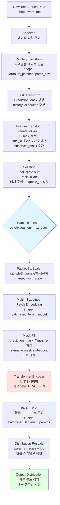
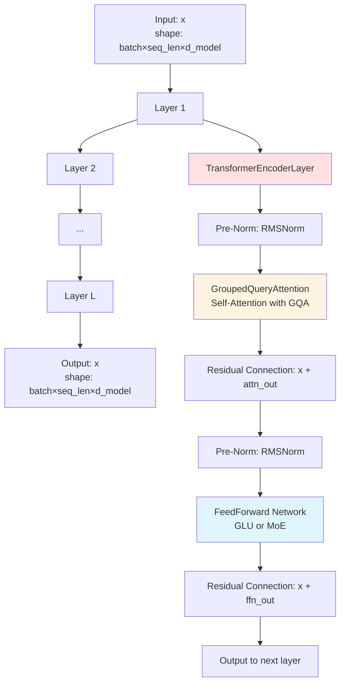
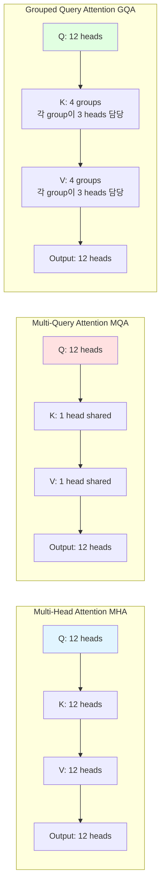
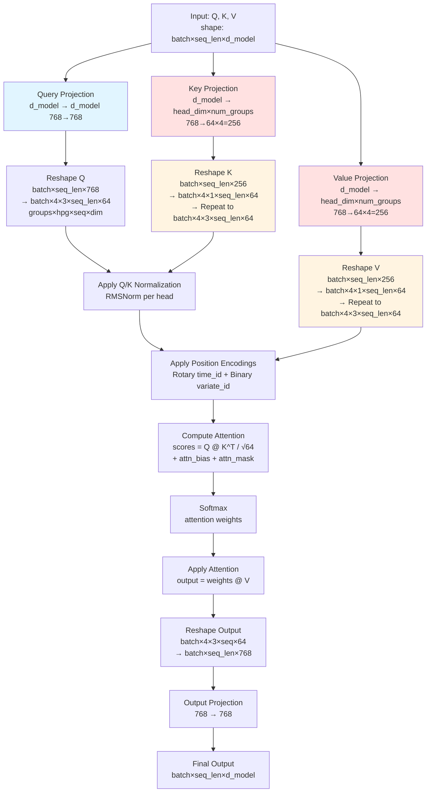
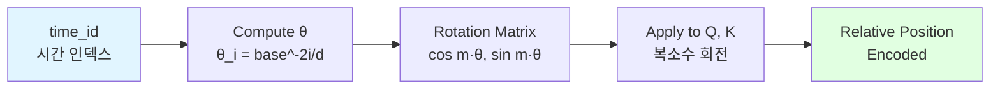
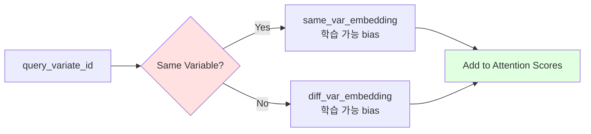
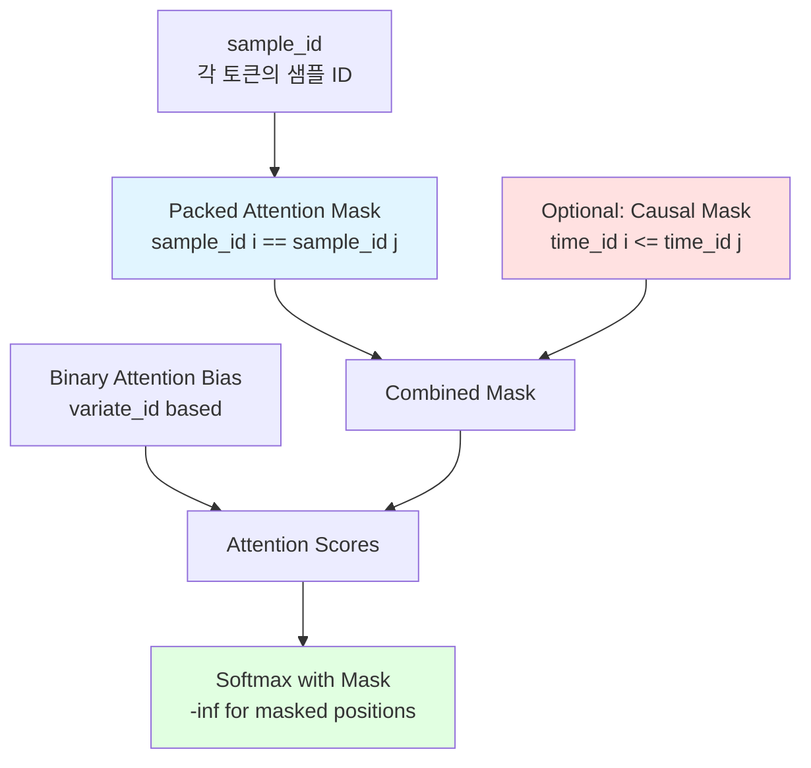
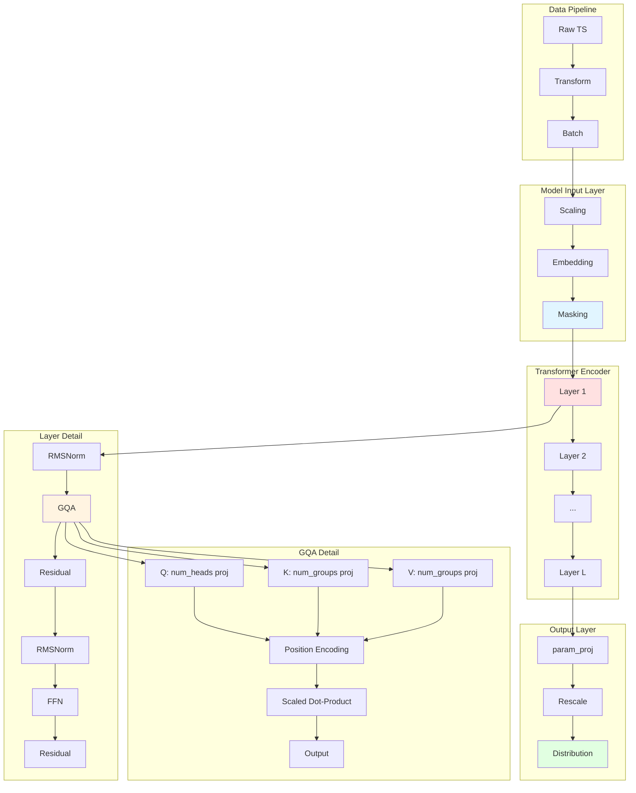

# Uni2TS 데이터 흐름 및 Grouped Query Attention 아키텍처

## 1. 전체 데이터 파이프라인 (End-to-End Data Flow)



### 각 단계별 텐서 Shape 변화

```
예시: batch_size=2, 각 시계열 길이=512, patch_size=16, d_model=768

1. Raw Data:           (2, 512)                    # 2개 시계열, 각 512 timesteps
2. Patchify:           (2, 32, 16)                 # 32개 패치, 각 16 timesteps
3. Pad to max:         (2, 32, 128)                # max_patch_size=128로 패딩
4. Add Features:
   - variate_id:       (2, 32)                     # 변수 ID
   - time_id:          (2, 32)                     # 시간 ID
   - sample_id:        (2, 32)                     # 샘플 ID
5. After Collation:    (batch_total, seq_len, 128) # 여러 샘플 병합
6. After Scaling:      (batch_total, seq_len, 128) # 정규화 적용
7. After Embedding:    (batch_total, seq_len, 768) # d_model=768로 투영
8. After Encoder:      (batch_total, seq_len, 768) # 동일한 shape 유지
9. After param_proj:   (batch_total, seq_len, num_params) # 분포 파라미터
```

## 2. Transformer Encoder 내부 구조



### TransformerEncoderLayer 상세 흐름

```
Input: x [batch, seq_len, d_model=768]
  ↓
┌─────────────────────────────────────────┐
│ 1. Self-Attention Block                │
│   x_norm = RMSNorm(x)                  │
│   attn_out = GroupedQueryAttention(    │
│       query=x_norm,                     │
│       key=x_norm,                       │
│       value=x_norm,                     │
│       attn_mask=packed_attention_mask,  │
│       query_var_id=variate_id,          │
│       kv_var_id=variate_id,             │
│       query_time_id=time_id,            │
│       kv_time_id=time_id                │
│   )                                     │
│   x = x + attn_out  # Residual         │
└─────────────────────────────────────────┘
  ↓
┌─────────────────────────────────────────┐
│ 2. FeedForward Block                    │
│   x_norm = RMSNorm(x)                  │
│   ffn_out = FeedForward(x_norm)        │
│   # d_model → hidden_dim → d_model    │
│   x = x + ffn_out  # Residual          │
└─────────────────────────────────────────┘
  ↓
Output: x [batch, seq_len, d_model=768]
```

## 3. Grouped Query Attention (GQA) 상세 메커니즘

### 3.1 GQA 개념 비교



**메모리 사용량 비교** (d_model=768, num_heads=12, head_dim=64):

```
MHA: Q(768→768) + K(768→768) + V(768→768) = 2304 parameters per token
MQA: Q(768→768) + K(768→64)  + V(768→64)  = 896 parameters per token
GQA: Q(768→768) + K(768→256) + V(768→256) = 1280 parameters per token (num_groups=4)

메모리 절약: GQA는 MHA 대비 약 44% 메모리 절약, MQA 대비 품질 유지
```

### 3.2 GQA Forward Pass 상세 흐름



### 3.3 GQA 구현 코드 핵심 부분

```python
class GroupedQueryAttention(nn.Module):
    def __init__(
        self,
        dim: int = 768,              # d_model
        num_heads: int = 12,         # Query heads 수
        num_groups: int = 4,         # Key/Value group 수
        bias: bool = False,
    ):
        self.num_heads = num_heads
        self.num_groups = num_groups
        self.heads_per_group = num_heads // num_groups  # 12 // 4 = 3
        self.head_dim = dim // num_heads                 # 768 // 12 = 64

        # Query는 모든 head에 대해 projection
        self.q_proj = nn.Linear(dim, dim, bias=bias)  # 768 → 768

        # Key/Value는 group 수만큼만 projection (메모리 절약!)
        self.k_proj = nn.Linear(dim, self.head_dim * num_groups, bias=bias)  # 768 → 256
        self.v_proj = nn.Linear(dim, self.head_dim * num_groups, bias=bias)  # 768 → 256

        self.out_proj = nn.Linear(dim, dim, bias=bias)  # 768 → 768

    def forward(self, query, key, value):
        # Query: 모든 head로 project
        q = self.q_proj(query)  # [batch, seq, 768]
        q = q.view(*batch, seq_len, self.num_groups, self.heads_per_group, self.head_dim)
        # → [batch, seq, 4, 3, 64]

        # Key: group만큼만 project
        k = self.k_proj(key)    # [batch, seq, 256]
        k = k.view(*batch, seq_len, self.num_groups, 1, self.head_dim)
        # → [batch, seq, 4, 1, 64]
        k = k.expand(*batch, seq_len, self.num_groups, self.heads_per_group, self.head_dim)
        # → [batch, seq, 4, 3, 64] (repeat to match query heads)

        # Value: group만큼만 project
        v = self.v_proj(value)  # [batch, seq, 256]
        v = v.view(*batch, seq_len, self.num_groups, 1, self.head_dim)
        # → [batch, seq, 4, 1, 64]
        v = v.expand(*batch, seq_len, self.num_groups, self.heads_per_group, self.head_dim)
        # → [batch, seq, 4, 3, 64]

        # Attention 계산
        scores = torch.matmul(q, k.transpose(-2, -1)) / math.sqrt(self.head_dim)
        # [batch, 4, 3, seq, seq]

        attn_weights = F.softmax(scores, dim=-1)
        attn_out = torch.matmul(attn_weights, v)  # [batch, 4, 3, seq, 64]

        # Reshape and project
        attn_out = attn_out.view(*batch, seq_len, dim)  # [batch, seq, 768]
        output = self.out_proj(attn_out)

        return output
```

## 4. Position Encoding 상세

### 4.1 Rotary Positional Encoding (RoPE) - Time



**RoPE 수식**:
```
θ_i = 1 / (10000^(2i/d_model))
m_θ = position × θ
rotation = [cos(m·θ), -sin(m·θ)]
            [sin(m·θ),  cos(m·θ)]
```

**특징**:
- Partial RoPE: head_dim의 일부만 회전 (예: 50% → 32/64 차원)
- Q와 K에만 적용, V는 그대로
- 상대적 위치 정보 인코딩

### 4.2 Binary Attention Bias - Variate



**효과**:
- 같은 변수 내 attention 강화
- 다른 변수 간 attention 억제 또는 조절
- 다변량 시계열에서 변수 간 간섭 방지

## 5. Attention Mask 구성



**Mask 종류**:

1. **Packed Attention Mask**: 같은 샘플 내에서만 attention 허용
   ```
   mask[i, j] = (sample_id[i] == sample_id[j])
   ```

2. **Causal Mask** (Moirai2에서 사용): 현재 또는 이전 시점만 참조
   ```
   mask[i, j] = (time_id[i] >= time_id[j])
   ```

3. **Binary Attention Bias**: 같은 변수 vs 다른 변수
   ```
   bias[i, j] = same_var_emb if (variate_id[i] == variate_id[j])
                else diff_var_emb
   ```

## 6. 전체 시스템 통합 뷰



## 7. 실제 사용 예시 (Moirai-1.0-R)

### 설정값
```python
# Model Configuration
d_model = 1024              # 모델 차원
num_heads = 16              # num_heads = d_model / 64 = 1024 / 64
num_groups = 16             # MHA와 동일 (GQA 미사용)
num_layers = 24             # Encoder 레이어 수
max_seq_len = 2048          # 최대 시퀀스 길이
max_patch_size = 128        # 최대 패치 크기

# Attention Configuration
head_dim = 64               # 각 head의 차원
heads_per_group = 1         # 16 / 16 = 1 (MHA)
use_qk_norm = True          # Q/K normalization 사용
attn_dropout_p = 0.0        # Attention dropout 없음

# Position Encoding
var_attn_bias = BinaryAttentionBias     # 변수별 attention bias
time_qk_proj = RotaryProjection          # 시간 RoPE
  - base = 10000
  - partial_factor = (0.0, 0.5)          # 중간 50% 차원에만 적용
```

### 데이터 흐름 예시

```
입력: 일별 주가 데이터 (1년 = 365일)
├─ 목표: 다음 30일 예측
├─ 변수: Open, High, Low, Close, Volume (5개)
└─ 설정: patch_size=16, prediction_length=30

Step 1: Patchify
  - 365 → 23 patches (each 16 days)
  - Shape: (5 vars, 23 patches, 16 timesteps)

Step 2: Feature Engineering
  - variate_id: [0,0,...,0,1,1,...,1,2,2,...,4] (5×23=115 tokens)
  - time_id: [0,1,...,22,0,1,...,22,...]
  - prediction_mask: last 2 patches per variable = True

Step 3: Embedding
  - (115, 16) → MultiInSizeLinear → (115, 1024)

Step 4: Encoder (24 layers)
  - Each layer: GQA + FFN
  - Attention only within same sample (packed_attention_mask)
  - Binary bias: same variable gets higher attention
  - Rotary encoding: temporal relationships

Step 5: Output
  - (115, 1024) → param_proj → (115, num_params)
  - Create Normal/StudentT distribution
  - Sample predictions for horizon tokens (prediction_mask=True)
```

## 8. GQA의 장점 정리

### 메모리 효율성
```
MHA (num_groups=num_heads=16):
  K_proj: 1024 → 1024
  V_proj: 1024 → 1024
  Total KV params: 2048 per token

GQA (num_groups=4, num_heads=16):
  K_proj: 1024 → 256
  V_proj: 1024 → 256
  Total KV params: 512 per token

메모리 절약: 75% ↓ (KV cache 기준)
```

### 성능 vs 효율성 Trade-off
```
MQA (num_groups=1):     ⚡ 가장 빠름, 메모리 최소, 성능 하락
GQA (num_groups=4~8):   ⚡ 빠름, 메모리 절약, 성능 유지
MHA (num_groups=16):    ⚡ 느림, 메모리 많음, 성능 최고
```

### Inference 시 특히 유리
- KV cache 크기 감소 → 긴 시퀀스 처리 가능
- Batch size 증가 가능
- Throughput 향상

---

## 참고 파일 경로

### 핵심 구현 파일
- **Attention**: `src/uni2ts/module/attention.py:58-306`
- **Transformer**: `src/uni2ts/module/transformer.py`
- **Model**: `src/uni2ts/model/moirai/module.py`
- **Data Pipeline**: `src/uni2ts/data/dataset.py`, `src/uni2ts/data/loader.py`
- **Transforms**: `src/uni2ts/transform/`

### 설정 파일
- **Moirai-1.0-R**: `config/model/moirai_1.0_R.yaml`
- **Training**: `config/task/pretrain.yaml`
- **Data**: `config/data/*.yaml`
